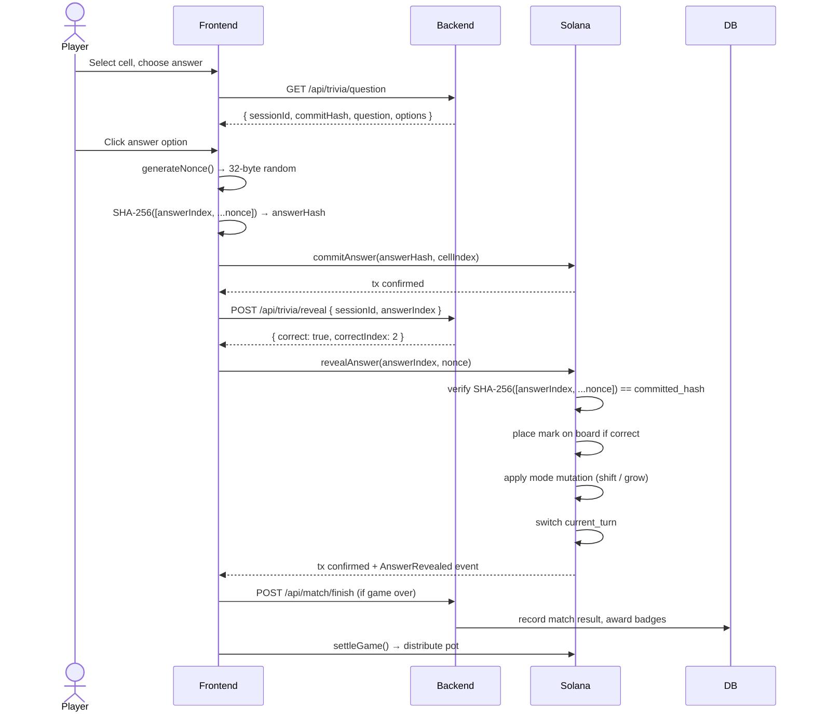
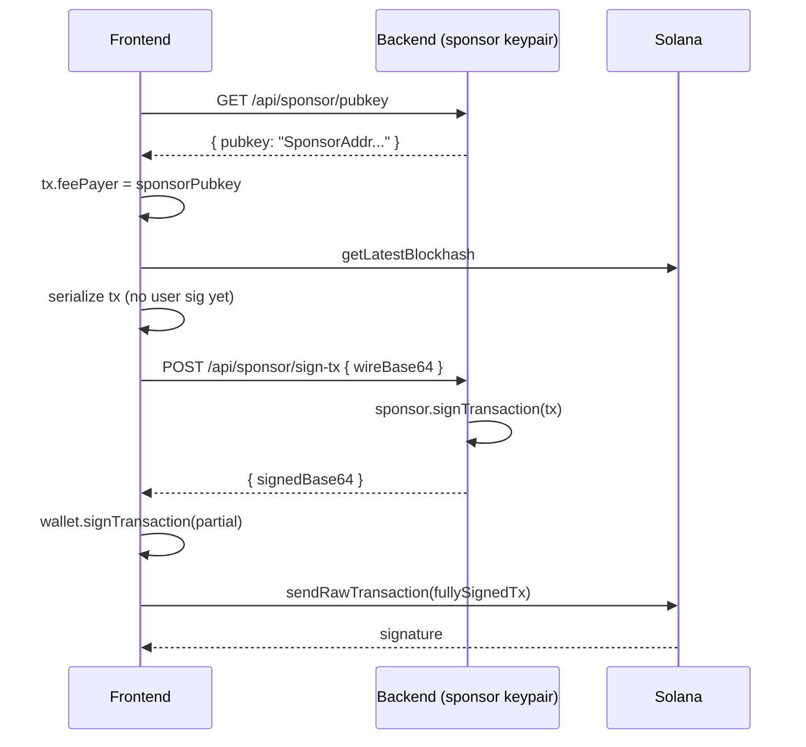
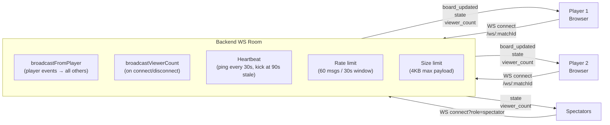

# MindDuel — System Architecture

This document describes the full technical architecture of MindDuel: how every layer connects, how data flows between components, and how the on-chain and off-chain systems interact.

---

## High-Level Overview

MindDuel is a three-layer system:

1. **Frontend (Next.js)** — React UI, wallet integration, on-chain transaction construction.
2. **Backend (Fastify)** — Stateless trivia API, commit-reveal anti-cheat session store, match metadata DB, WebSocket relay, tournament orchestration.
3. **Solana / Anchor** — Trustless escrow, trivia-gated move validation, fund settlement. The on-chain program is the ultimate source of truth for all game state.

The backend never holds player funds and never can. All financial logic is enforced by the Anchor program.

---

## System Architecture Diagram


---

## Data Flow: One Full Turn



---

## Frontend Component Tree

```
app/
├── layout.tsx                  # Root layout: ThemeProvider, ClientProviders (WalletAdapter)
├── page.tsx                    # Landing / home
├── lobby/
│   └── page.tsx                # Create match, join by code, matchmaking queue
├── game/
│   └── [matchId]/
│       └── page.tsx            # Game room: board + trivia + hints
├── result/
│   └── page.tsx                # Win / draw / loss screen with on-chain proof
├── leaderboard/
│   └── page.tsx                # Global leaderboard (from backend DB)
├── history/
│   └── page.tsx                # Player match history
├── tournaments/
│   ├── page.tsx                # List open tournaments
│   └── [id]/page.tsx           # Tournament bracket view
├── spectate/
│   └── [matchId]/page.tsx      # Read-only spectator view
└── profile/
    └── page.tsx                # Player profile + earned badges

components/
├── game/
│   ├── BoardRenderer.tsx       # Tic Tac Toe board grid, Framer Motion cell animations
│   ├── TriviaPanel.tsx         # Question display, answer options, countdown timer
│   ├── HintPanel.tsx           # Hint selector + on-chain claim confirmation
│   ├── ScoreBar.tsx            # Pot display, drama score, round counter
│   └── GameHeader.tsx          # Player avatars, current turn indicator
├── ui/
│   ├── Button.tsx              # Primary / secondary / danger variants
│   ├── Card.tsx                # Panel wrapper (dark indigo background)
│   ├── Badge.tsx               # Chip / tag component
│   ├── Modal.tsx               # Dialog with Framer Motion overlay
│   ├── Toast.tsx               # Bottom-right notification, auto-dismiss 3s
│   ├── Skeleton.tsx            # Shimmer placeholder (animate-pulse)
│   ├── SkeletonRow.tsx         # Table-row placeholder
│   ├── Icons.tsx               # SVG icon library
│   ├── StateIcons.tsx          # Win / lose / draw / waiting icons
│   └── ConfirmDialog.tsx       # Two-step action confirmation
├── wallet/
│   └── WalletButton.tsx        # Connect / disconnect wallet pill
└── layout/
    ├── NavBar.tsx              # Top navigation
    ├── BottomTabBar.tsx        # Mobile bottom tab navigation
    └── Footer.tsx

hooks/
├── useGameState.ts             # Subscribe to GameAccount PDA via Solana RPC WebSocket
├── useAnchorClient.ts          # Build AnchorClient from connected wallet
├── useTriviaSession.ts         # Client-side commit-reveal: generateNonce, SHA-256 hash
├── useHint.ts                  # Claim hint on-chain + fetch hint data from backend
└── useNetworkCheck.ts          # Detect devnet / mainnet mismatch

lib/
├── anchor-client.ts            # All Anchor tx builders (initializeGame, commitAnswer, ...)
├── trivia.ts                   # Fetch trivia question, hash helpers
├── api.ts                      # Backend REST client (typed fetch wrappers)
├── constants.ts                # PROGRAM_ID, TREASURY_ADDRESS, STAKE_TIERS, HINTS, ...
├── sounds.ts                   # Sound effect manager
├── tokens.ts                   # Design token helpers
├── signing-signal.ts           # Shows "awaiting wallet signature" banner during tx
└── utils.ts                    # General utilities (cn, truncateAddress, ...)
```

---

## Backend Architecture

```
backend/src/
├── index.ts                    # Fastify server bootstrap, CORS, plugin registration
├── routes/
│   ├── trivia.ts               # GET /api/trivia/question, POST /api/trivia/reveal,
│   │                           # GET /api/trivia/peek, GET /api/trivia/categories,
│   │                           # GET /api/trivia/stats
│   ├── match.ts                # POST /api/match/create, POST /api/match/join,
│   │                           # GET /api/match/:matchId, POST/DELETE /api/match/queue,
│   │                           # GET /api/match/player/:playerId
│   ├── stats.ts                # GET /api/leaderboard, GET /api/history/:player,
│   │                           # POST /api/match/finish, POST /api/match/vsai,
│   │                           # GET /api/badges/:player
│   ├── tournament.ts           # POST /api/tournament/create, GET /api/tournament/list,
│   │                           # GET /api/tournament/:id, POST /api/tournament/:id/join,
│   │                           # GET /api/tournament/:id/bracket
│   ├── faucet.ts               # POST /api/faucet (devnet mock-USDC dispenser)
│   ├── sponsor.ts              # GET /api/sponsor/pubkey, POST /api/sponsor/sign-tx
│   └── ws.ts                   # WS /ws/:matchId (rooms, broadcast, heartbeat, rate-limit)
├── lib/
│   ├── db.ts                   # Drizzle ORM + Neon PostgreSQL connection
│   ├── schema.ts               # Drizzle table schemas (matches, badges, tournaments)
│   ├── match-store.ts          # Match CRUD, matchmaking queue, leaderboard queries
│   ├── commit-reveal.ts        # In-memory session store with 10-minute TTL
│   ├── badges.ts               # Badge type metadata + award logic
│   └── tournament-store.ts     # Tournament creation, join, bracket generation
└── data/
    └── questions.ts            # Curated question bank: 6 categories, 3 difficulties
```

---

## Anchor Program Structure

```
programs/mind-duel/src/
├── lib.rs                      # Program entry point, all instruction handlers dispatched
├── constants.rs                # PLATFORM_FEE_BPS, hint prices, PDA seeds, TREASURY_PUBKEY
├── errors.rs                   # MindDuelError enum (15 variants with descriptive messages)
├── state/
│   ├── mod.rs                  # Re-exports game + hint_ledger
│   ├── game.rs                 # GameAccount, GameStatus, GameMode, CellState, Currency
│   └── hint_ledger.rs          # HintLedger, HintType (bitmask-based used-hints tracking)
└── instructions/
    ├── mod.rs                  # Re-exports all instruction modules
    ├── initialize_game.rs      # SOL escrow game creation
    ├── join_game.rs            # Player two joins, stakes match
    ├── commit_answer.rs        # Store answer hash on-chain
    ├── reveal_answer.rs        # Verify hash, place mark, mode mutations
    ├── claim_hint.rs           # SOL hint purchase with 80/20 split
    ├── settle_game.rs          # Distribute pot (win / draw / timeout)
    ├── timeout_turn.rs         # Force turn switch after timeout
    ├── cancel_match.rs         # Cancel waiting SOL match, full refund
    ├── resign_game.rs          # Concede active SOL match
    ├── initialize_game_usdc.rs # USDC SPL-token variant of initialize
    ├── join_game_usdc.rs       # USDC join
    ├── settle_game_usdc.rs     # USDC settle (ATA transfers)
    ├── cancel_match_usdc.rs    # USDC cancel
    ├── claim_hint_usdc.rs      # USDC hint purchase
    └── resign_game_usdc.rs     # USDC resign
```

---

## PDA Derivation

All program-derived addresses use these deterministic seeds:

| Account | Seeds | Purpose |
|---|---|---|
| `GameAccount` | `["game", player_one.pubkey]` | One game per wallet at a time |
| `Escrow` | `["escrow", game.pubkey]` | Holds pot lamports (SOL) or ATA (USDC) |
| `HintLedger` | `["hint", game.pubkey, player.pubkey]` | Tracks used hints per player per game |

The escrow PDA is a system-owned account for SOL games and the authority for an SPL ATA for USDC games. All fund transfers out of escrow require the program's PDA signature — no external party can drain it.

---

## Sponsorship Flow (Gasless UX)

To avoid users needing SOL for transaction fees on devnet demos, the backend acts as a fee-payer sponsor:



If the sponsor endpoint is unreachable, the frontend falls back to user-paid transactions transparently.

---

## Real-Time WebSocket Architecture



Key properties:
- Spectators receive all events but their messages are dropped (read-only).
- The latest `board_updated` event is cached per room so late-joining clients replay the last board state immediately on connect.
- The room is destroyed (map entry deleted) when the last socket disconnects.

---

## Design Tokens

```
Background:  #0D0D1A  (deep navy-black)
Card surface: #14142B  (dark indigo)
Primary accent: #7C3AED  (violet-600) — active turn, CTA buttons
Secondary: #06B6D4  (cyan-500) — hint panel, info
Success: #10B981  (emerald-500) — correct answer, win
Danger: #EF4444  (red-500) — wrong answer, timeout
Text primary: #F1F5F9  (slate-100)
Text secondary: #94A3B8  (slate-400)
Border: #1E1E3F  (indigo-950)
```

Fonts: `Space Grotesk` (headings) + `Inter` (body/UI), served from Google Fonts.
