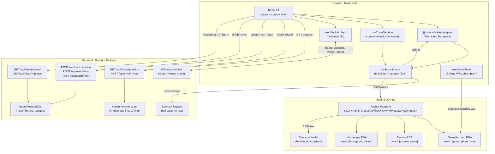
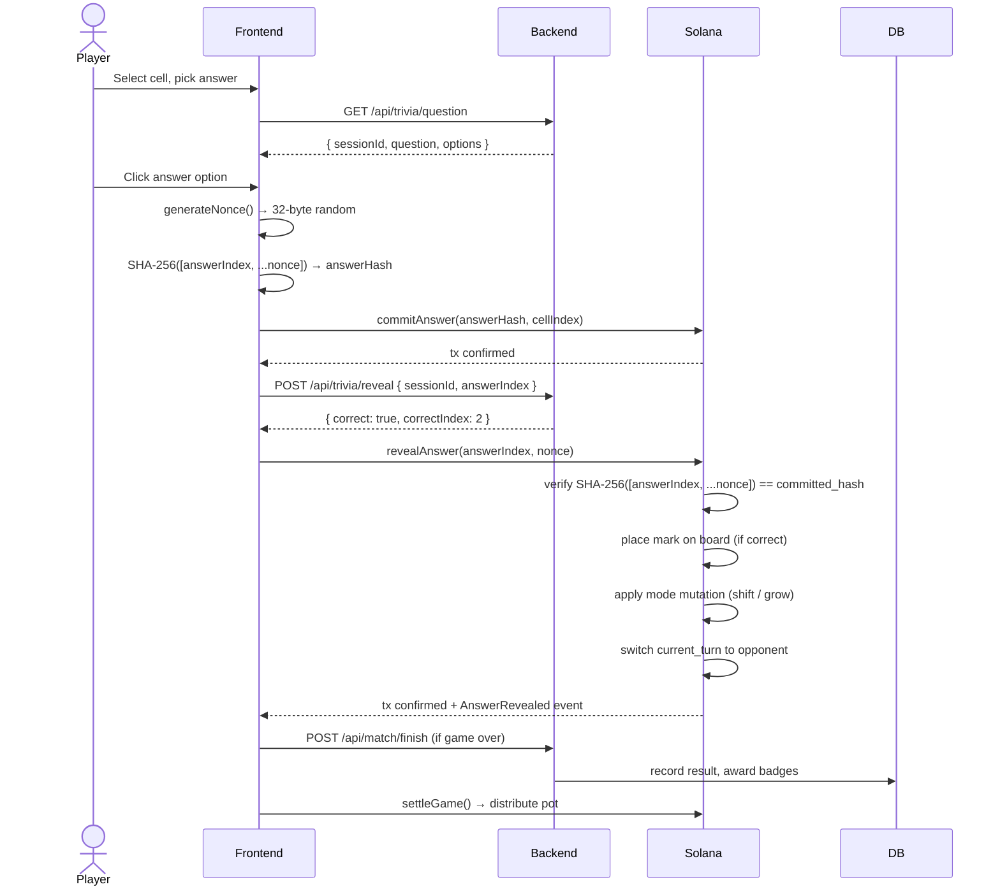
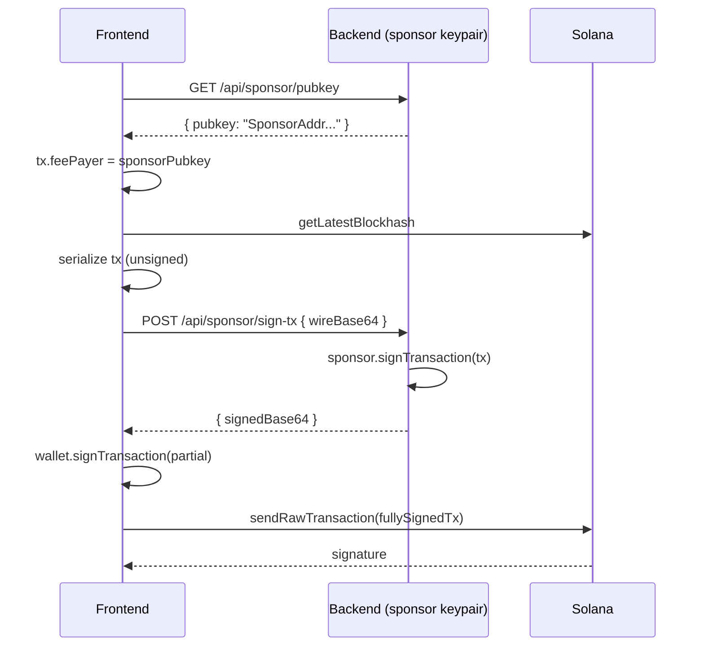
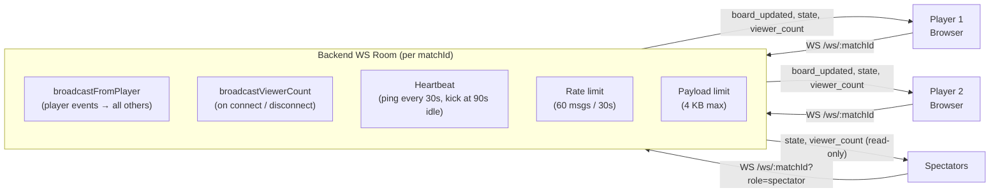

# Architecture

MindDuel is a three-layer system. Each layer has a clearly bounded responsibility, and the boundaries are enforced by design — not convention.

| Layer | Responsibility |
|---|---|
| **Solana / Anchor** | Trustless source of truth. Holds all funds. Enforces all game rules. |
| **Fastify Backend** | Stateless question server. Commit-reveal anti-cheat session store. Match metadata and leaderboard. |
| **Next.js Frontend** | Transaction construction. Wallet integration. Real-time UI. |

> The backend never holds player funds and is never in the critical path for financial correctness. Even if the backend goes offline, in-progress games on-chain remain valid and settleable.

---

## System Overview



---

## One Full Turn — Data Flow

This sequence shows the complete lifecycle of a single player turn, from cell selection to board update.



---

## Frontend Structure

### Pages

```
app/
├── page.tsx                    # Landing / home
├── lobby/page.tsx              # Create match, join by code, matchmaking queue
├── game/[matchId]/page.tsx     # Game room: board + trivia + hints
├── result/page.tsx             # Win / draw / loss + on-chain proof link
├── leaderboard/page.tsx        # Global leaderboard
├── history/page.tsx            # Player match history
├── tournaments/
│   ├── page.tsx                # List open tournaments
│   └── [id]/page.tsx           # Tournament bracket view
├── spectate/[matchId]/page.tsx # Read-only spectator view
└── profile/page.tsx            # Player profile + earned badges
```

### Components

```
components/
├── game/
│   ├── BoardRenderer.tsx       # TTT grid with Framer Motion cell animations
│   ├── TriviaPanel.tsx         # Question display, answer options, countdown timer
│   ├── HintPanel.tsx           # Hint selector + on-chain claim confirmation
│   ├── ScoreBar.tsx            # Pot, drama score, round counter
│   └── GameHeader.tsx          # Player avatars, current turn indicator
├── ui/
│   ├── Button.tsx              # Primary / secondary / danger variants
│   ├── Card.tsx                # Panel wrapper (dark indigo surface)
│   ├── Badge.tsx               # Chip / tag component
│   ├── Modal.tsx               # Dialog with Framer Motion overlay
│   ├── Toast.tsx               # Bottom-right notification, auto-dismiss 3s
│   ├── Skeleton.tsx            # Shimmer placeholder
│   ├── Icons.tsx               # SVG icon library
│   └── ConfirmDialog.tsx       # Two-step action confirmation
├── wallet/
│   └── WalletButton.tsx        # Connect / disconnect wallet pill
└── layout/
    ├── NavBar.tsx
    ├── BottomTabBar.tsx        # Mobile bottom tab navigation
    └── Footer.tsx
```

### Hooks

| Hook | Purpose |
|---|---|
| `useGameState` | Subscribe to GameAccount PDA via Solana RPC WebSocket |
| `useAnchorClient` | Build AnchorClient from connected wallet |
| `useTriviaSession` | Client-side commit-reveal: nonce generation and SHA-256 hash |
| `useHint` | Claim hint on-chain and fetch hint data from backend |
| `useNetworkCheck` | Detect devnet / mainnet mismatch and warn the user |

### Core Libraries

| File | Purpose |
|---|---|
| `anchor-client.ts` | All Anchor transaction builders |
| `trivia.ts` | Question fetching and hash helpers |
| `api.ts` | Typed fetch wrappers for the backend REST API |
| `constants.ts` | `PROGRAM_ID`, `TREASURY_ADDRESS`, stake tiers, hint config |
| `signing-signal.ts` | Shows "awaiting wallet signature" banner during pending txs |
| `sounds.ts` | Sound effect manager |

---

## Backend Structure

```
backend/src/
├── index.ts                    # Fastify bootstrap, CORS, plugin registration
├── routes/
│   ├── trivia.ts               # GET /api/trivia/question  POST /api/trivia/reveal
│   │                           # GET /api/trivia/peek      GET /api/trivia/stats
│   ├── match.ts                # POST /api/match/create    POST /api/match/join
│   │                           # GET /api/match/:matchId   POST /api/match/queue
│   ├── stats.ts                # GET /api/leaderboard      GET /api/history/:player
│   │                           # POST /api/match/finish    GET /api/badges/:player
│   ├── tournament.ts           # Full tournament lifecycle (create, join, bracket)
│   ├── faucet.ts               # POST /api/faucet (devnet mock-USDC dispenser)
│   ├── sponsor.ts              # GET /api/sponsor/pubkey   POST /api/sponsor/sign-tx
│   └── ws.ts                   # WS /ws/:matchId (rooms, broadcast, heartbeat)
├── lib/
│   ├── db.ts                   # Drizzle ORM + Neon PostgreSQL connection
│   ├── schema.ts               # Table schemas: matches, badges, tournaments
│   ├── match-store.ts          # Match CRUD, matchmaking queue, leaderboard queries
│   ├── commit-reveal.ts        # In-memory session store, TTL 10 minutes
│   ├── badges.ts               # Badge type metadata and award logic
│   └── tournament-store.ts     # Tournament creation, join, bracket generation
└── data/
    └── questions.ts            # 6 categories · 3 difficulty tiers · 180+ questions
```

---

## Anchor Program Structure

```
programs/mind-duel/src/
├── lib.rs                      # Entry point — all instruction handlers dispatched
├── constants.rs                # PLATFORM_FEE_BPS, hint prices, PDA seeds, TREASURY_PUBKEY
├── errors.rs                   # MindDuelError enum (15 variants)
├── state/
│   ├── mod.rs
│   ├── game.rs                 # GameAccount, GameStatus, GameMode, CellState, Currency
│   └── hint_ledger.rs          # HintLedger, HintType (bitmask-based)
└── instructions/
    ├── initialize_game.rs      # SOL game creation
    ├── join_game.rs            # Player two joins, stakes
    ├── commit_answer.rs        # Store answer hash on-chain
    ├── reveal_answer.rs        # Verify hash, place mark, apply mutations
    ├── claim_hint.rs           # SOL hint purchase with 80/20 split
    ├── settle_game.rs          # Distribute SOL pot
    ├── timeout_turn.rs         # Force turn switch after timeout
    ├── cancel_match.rs         # Cancel waiting game, full refund
    ├── resign_game.rs          # Concede active game
    ├── initialize_game_usdc.rs # USDC variant
    ├── join_game_usdc.rs
    ├── settle_game_usdc.rs
    ├── cancel_match_usdc.rs
    ├── claim_hint_usdc.rs
    └── resign_game_usdc.rs
```

---

## PDA Derivation

All program-derived addresses use deterministic seeds. These can be independently computed by any client.

| Account | Seeds | Notes |
|---|---|---|
| `GameAccount` | `["game", player_one.pubkey]` | One active game per wallet at a time |
| `Escrow` (SOL) | `["escrow", game.pubkey]` | System-owned — program holds the signing authority |
| `Escrow` (USDC) | ATA of Escrow PDA | SPL ATA derived using standard `getAssociatedTokenAddressSync` |
| `HintLedger` | `["hint", game.pubkey, player.pubkey]` | Per player per game; initialized on first hint purchase |

No external party can derive a valid signature for any of these PDAs — only the program can.

---

## Sponsorship Flow (Gasless UX)

To eliminate the friction of needing SOL for transaction fees during devnet demos, the backend can act as a fee-payer sponsor.



If the sponsor endpoint is unreachable, the frontend falls back to user-paid transactions with no user-visible interruption.

---

## Real-Time WebSocket Architecture



Key behaviors:
- Spectators receive all events but their outbound messages are silently dropped.
- The latest `board_updated` payload is cached per room. Late-joining clients receive it immediately on connect.
- The room entry is deleted when the last socket disconnects.

---

## Design Tokens

The entire frontend uses a single token set. No hardcoded hex values appear in component code.

| Token | Value | Usage |
|---|---|---|
| Background | `#0D0D1A` | Page background (deep navy-black) |
| Card surface | `#14142B` | Panel and card backgrounds (dark indigo) |
| Primary accent | `#7C3AED` (violet-600) | Active turn indicator, CTA buttons |
| Secondary accent | `#06B6D4` (cyan-500) | Hint panel, info states |
| Success | `#10B981` (emerald-500) | Correct answer, win state |
| Danger | `#EF4444` (red-500) | Wrong answer, timeout |
| Text primary | `#F1F5F9` (slate-100) | All body and heading text |
| Text secondary | `#94A3B8` (slate-400) | Captions, helper text |
| Border | `#1E1E3F` (indigo-950) | Card borders, dividers |

Fonts: **Space Grotesk** (headings) and **Inter** (body / UI), loaded from Google Fonts.
