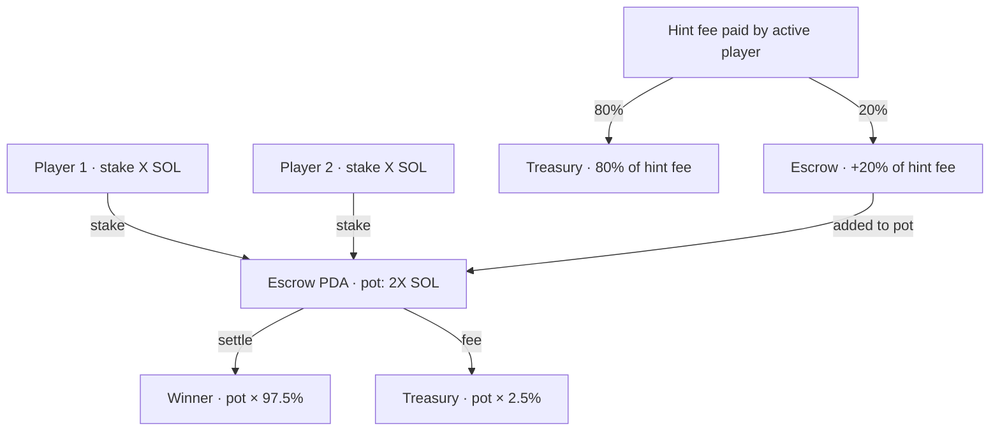

# Game Mechanics

MindDuel layers knowledge onto a universally understood game. This document covers every game mode, the commit-reveal answer security scheme, the trivia flow, the hint economy, and all win, draw, and timeout conditions.

---

## Core Concept

Standard Tic Tac Toe is a solved game — optimal play always ends in a draw. MindDuel breaks that by adding a **knowledge gate**: before a player can place a piece, they must correctly answer a trivia question. Miss the answer and the turn passes to the opponent.

This creates a second skill axis on top of board strategy. A player with weaker board intuition but stronger trivia knowledge can consistently win games they would lose otherwise — and vice versa.

**Financial layer:** Both players lock their stake into a trustless escrow PDA before the game starts. The winner collects the full pot minus a 2.5% platform fee. No server ever holds the funds.

---

## Game Modes

### Classic Duel

The baseline experience.

- Standard 3×3 Tic Tac Toe board.
- First player to align three marks (horizontal, vertical, or diagonal) wins.
- If all 9 cells are filled with no winner, the pot is split 50/50.
- Turn timeout: **24 hours**. After expiry, either player may call `timeout_turn` to force the inactive player's turn to pass.

### Shifting Board

The board itself becomes a threat.

- Starts as a 3×3 Classic game.
- **Every 3 rounds**, the entire board rotates in one of four directions: rows shift down, rows shift up, columns shift right, or columns shift left.
- The shift direction is determined by `Clock::get()?.slot % 4` — unpredictable yet deterministic and verifiable by every participant without an oracle.
- Pieces keep their owner marks after the shift. A player one move away from winning might suddenly lose alignment; an opponent's scattered pieces might form a winning line.
- Strategy must account for future board states, not just the current one.

### Scale Up

The playing field grows as skill accumulates.

- Starts as 3×3. Win condition is always three consecutive marks — regardless of board size.
- After round 4, the board expands to **4×4**. Existing pieces are preserved in the top-left quadrant; new cells are empty.
- After round 9, the board expands to **5×5**. Same expansion logic.
- The on-chain `board` field is always a flat array of 25 cells; the `board_size` field tracks the active dimension.
- On 4×4 and 5×5 boards, the win-detection algorithm slides a 3-cell window over every possible row, column, and diagonal — standard TTT win conditions remain, just within a larger space.

### Blitz

Speed is the third dimension.

- Each turn has a hard **5-minute (300 second) on-chain timeout**.
- If a player does not complete their commit + reveal within 300 seconds of the previous action, the opponent can call `timeout_turn` to clear the pending commit and flip the turn.
- Even if a reveal is submitted after the window expires, `reveal_answer` treats the answer as wrong — no piece is placed, but the committed hash is cleared and the turn passes.
- Designed for players who want a decisive, time-pressured match.

### vs AI (Practice)

A zero-risk mode to learn the trivia flow.

- No on-chain stake. The AI opponent logic runs entirely in the frontend.
- Results are recorded in the backend database as practice matches (opponent stored as `"AI"`).
- Excluded from the main leaderboard, which filters for valid Solana wallet addresses.
- The full trivia commit-reveal flow still applies — players must answer correctly to place pieces.

---

## Commit-Reveal Answer Scheme

The commit-reveal pattern prevents two categories of cheating without requiring a trusted oracle.

**Answer snooping:** Without this scheme, a malicious player could watch the mempool for their opponent's answer transaction and submit their own answer only after seeing whether the opponent succeeded.

**Answer replay:** Re-using a previously seen `(answer_index, nonce)` pair from an earlier turn.

### How It Works

```mermaid
sequenceDiagram
    actor P as Player
    participant FE as Frontend
    participant BE as Backend
    participant CH as Solana Chain

    P->>FE: View question, select answer
    FE->>BE: GET /api/trivia/question
    BE->>BE: Pick question · create session
    BE-->>FE: { sessionId, question, options[] }

    P->>FE: Click answer option
    FE->>FE: nonce = crypto.getRandomValues(32 bytes)
    FE->>FE: answerHash = SHA-256([answerIndex byte, ...nonce])
    FE->>CH: commitAnswer(answerHash, cellIndex)
    Note over CH: Stores committed_hash, committed_cell
    CH-->>FE: tx confirmed

    FE->>BE: POST /api/trivia/reveal { sessionId, answerIndex }
    BE-->>FE: { correct: true/false, correctIndex: N }

    FE->>CH: revealAnswer(answerIndex, nonce)
    Note over CH: Recomputes SHA-256([answerIndex, nonce])\nMust equal committed_hash
    CH->>CH: If correct: place mark on board
    CH->>CH: Apply mode mutation (shift / grow)
    CH->>CH: Clear committed_hash → [0u8; 32]
    CH->>CH: Switch current_turn to opponent
    CH-->>FE: AnswerRevealed event
```

### Hash Construction

The client produces the commitment using the Web Crypto API:

```typescript
// frontend/src/lib/trivia.ts
const preimage = new Uint8Array(33)
preimage[0] = answerIndex           // 0, 1, 2, or 3
preimage.set(nonce, 1)              // 32-byte random nonce
const hashBuffer = await crypto.subtle.digest('SHA-256', preimage)
```

The program verifies using `solana_program::hash::hash`, which is SHA-256:

```rust
// programs/mind-duel/src/instructions/reveal_answer.rs
let mut preimage = [0u8; 33];
preimage[0] = answer_index;
preimage[1..].copy_from_slice(&nonce);
let computed = hash::hash(&preimage).to_bytes();
require!(computed == game.committed_hash, MindDuelError::HashMismatch);
```

Both sides produce identical output for the same input. The contract is the verifier — no trust in any server required.

### Wrong Answer Convention

When the backend confirms the answer is wrong (`correct: false`), the frontend calls `revealAnswer` with `answer_index = 255`. The program treats `255` as an explicit wrong answer: no piece is placed, but the committed hash is cleared and the turn passes to the opponent. This keeps the game flowing after every incorrect answer.

---

## Trivia Question Flow

1. Frontend calls `GET /api/trivia/question` with optional `categories` and `difficulty` filters.
2. Backend selects a random question from the filtered pool. If fewer than 3 questions match the filter, it falls back to the full question bank.
3. Backend creates an in-memory session (10-minute TTL) storing `questionId` and `correctIndex`, keyed by a random `sessionId`.
4. Backend returns the question **without** the correct index.
5. Player selects an answer. Frontend generates a 32-byte nonce, computes the commitment hash, and submits `commitAnswer` on-chain.
6. Frontend calls `POST /api/trivia/reveal { sessionId, answerIndex }`. Backend checks the session and returns `{ correct, correctIndex }`.
7. Frontend calls `revealAnswer` on-chain. The program verifies the hash independently.

### Question Categories

| Category | Coverage |
|---|---|
| General Knowledge | Broad trivia across all topics |
| Crypto & Web3 | Blockchain, DeFi, NFTs, Solana ecosystem |
| Science | Physics, biology, chemistry |
| History | World history, major events |
| Math | Arithmetic, algebra, logic puzzles |
| Pop Culture | Movies, music, internet culture |

### Difficulty Tiers

| Tier | Client-Side Time Limit |
|---|---|
| Easy | 30 seconds |
| Medium | 20 seconds |
| Hard | 15 seconds |

---

## Hint System

Hints are purchased on-chain. Each hint transfers a micro-fee from the player's wallet: 80% goes to the platform treasury, and 20% is added to the match's escrow — slightly increasing the winner's payout. Buying hints does not guarantee a win, but skillful hint use on critical turns rewards smart investment.

### Available Hints

| Hint | SOL Price | USDC Price | Effect |
|---|---|---|---|
| Eliminate 2 | 0.002 SOL | 0.40 USDC | Backend reveals two wrong answer indices |
| Category Reveal | 0.001 SOL | 0.20 USDC | Reveals the question's category |
| Extra Time | 0.003 SOL | 0.60 USDC | Adds 30 seconds to the client-side timer |
| First Letter | 0.001 SOL | 0.20 USDC | Backend reveals the first letter of the correct answer |
| Skip Question | 0.005 SOL | 1.00 USDC | Treats current question as a wrong-answer skip and advances the turn |

### Anti-Double-Spend

Each hint type is tracked as a bitmask bit in the `HintLedger` PDA for the `(game, player)` pair.

| Bit | Hint Type |
|---|---|
| 0 | EliminateTwo |
| 1 | CategoryReveal |
| 2 | ExtraTime |
| 3 | FirstLetter |
| 4 | Skip |

Once a bit is set, calling `claim_hint` with that type again fails with `MindDuelError::HintAlreadyUsed`. Each hint type is purchasable at most once per player per game.

### Revenue Split

```
Player pays hint_price
  ├─ 80% → Treasury wallet (hardcoded program constant)
  └─ 20% → Escrow PDA (added to prize pool)
```

---

## Win, Draw, and Timeout Conditions

### Win Detection

The `determine_winner` function performs a dynamic scan for any three consecutive matching marks within the active `board_size × board_size` area. It checks:

- All horizontal 3-cell windows in each row
- All vertical 3-cell windows in each column
- All top-left to bottom-right diagonal windows
- All top-right to bottom-left diagonal windows

The same algorithm handles 3×3, 4×4, and 5×5 boards without modification — it slides a 3-cell window over every possible line.

### Settlement Conditions

`settle_game` (and `settle_game_usdc`) requires that at least one of these is true before distributing funds:

| Condition | Description |
|---|---|
| Winner found | `determine_winner` returns a mark |
| Board full | All `board_size²` active cells are non-empty (draw) |
| Turn timed out | `now - last_action_ts >= timeout` (24h Classic / 300s Blitz) |

If none of these conditions hold, `settle_game` returns `MindDuelError::GameStillActive`. This prevents a losing player from calling settle early to claim a 50% draw payout.

### Fund Distribution

| Outcome | Distribution |
|---|---|
| Player X wins | X receives `pot × 97.5%`; treasury receives `pot × 2.5%` |
| Player O wins | O receives `pot × 97.5%`; treasury receives `pot × 2.5%` |
| Draw | Each player receives `(pot × 97.5%) / 2`; treasury receives `pot × 2.5%` |

### Resign

Any player in an active game may call `resign_game` to concede immediately. The opponent receives `pot - fee`. The `GameAccount` is closed and rent is refunded to `player_one`.

### Cancel

A game in `WaitingForPlayer` status (no second player has joined) may be cancelled by `player_one` via `cancel_match`. The full stake is refunded and the `GameAccount` is closed.

---

## Turn Timeout Reference

| Mode | Timeout | Enforcement |
|---|---|---|
| Classic | 24 hours | `timeout_turn` or `settle_game` timed-out check |
| Shifting Board | 24 hours | Same as Classic |
| Scale Up | 24 hours | Same as Classic |
| Blitz | 5 minutes | `timeout_turn` or `revealAnswer` blitz expiry check |

For Blitz, a reveal submitted after the 300-second window is still processed — the hash is cleared and the turn switches — but no piece is placed. Being technically correct on a stale reveal provides no board advantage.

---

## Drama Score

The `drama_score` field in `GameAccount` increments by +5 per turn, capped at 100. When it reaches or exceeds **80** (the `EPIC_DRAMA_THRESHOLD`), the match is flagged as an "Epic Game." 

Epic Game status unlocks a soulbound NFT badge minted via Metaplex to the winner's wallet. The score is stored on-chain and cannot be falsified or purchased.

---

## Economic Model



| Item | Value |
|---|---|
| Minimum stake | 0.01 SOL |
| Platform fee | 2.5% of total pot |
| Hint: Eliminate 2 | 0.002 SOL / 0.40 USDC |
| Hint: Category Reveal | 0.001 SOL / 0.20 USDC |
| Hint: Extra Time | 0.003 SOL / 0.60 USDC |
| Hint: First Letter | 0.001 SOL / 0.20 USDC |
| Hint: Skip Question | 0.005 SOL / 1.00 USDC |
| Hint treasury split | 80% |
| Hint prize pool boost | 20% |
| Draw resolution | 50/50 after fee |
| Epic Game NFT trigger | drama_score >= 80 |

### Stake Tiers

| Tier | Range | Description |
|---|---|---|
| Casual | 0.01 – 0.1 SOL | Low risk, good for new players |
| Challenger | 0.1 – 1 SOL | Balanced for experienced players |
| High Stakes | > 1 SOL | Maximum risk and reward |
