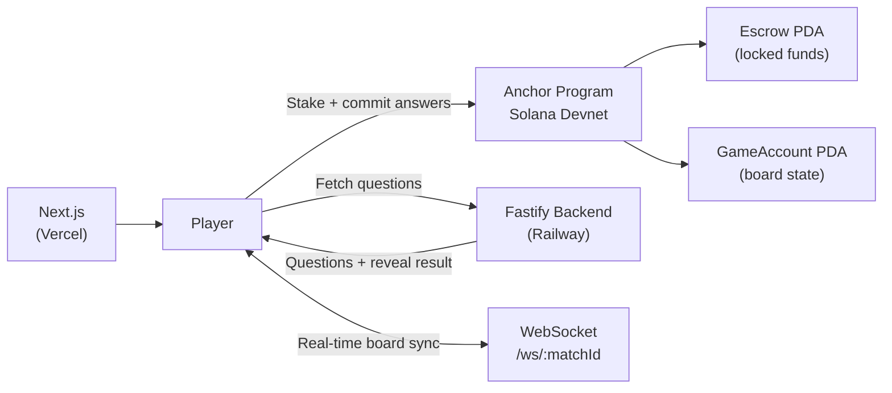
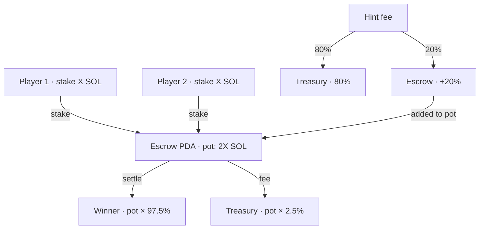

# Hackathon Submission

| | |
|---|---|
| **Hackathon** | Colosseum Frontier 2026 |
| **Track** | 100xDevs |
| **Category** | Consumer Gaming on Solana |
| **Builder** | Ezra Nahamry — solo entry |
| **Program ID** | `8XZTXNux374128LFJSVhp5XSNyYMPNZpfw4vyjWmSJkN` |
| **Live Demo** | [mindduel.app](https://mindduel.app) |

---

## Problem Statement

On-chain gaming on Solana today falls into two broad categories: **pure chance** (lottery, coin-flip games) and **speculation** (NFT flip mechanics). Neither rewards skill or knowledge. Meanwhile, real-money trivia games exist in Web2 — but they are fully centralized: the operator controls every question result, all funds, and can exit at any time.

The gap is clear. There is no on-chain, provably fair, skill-based game on Solana where:

1. A player's knowledge — not luck or capital size — determines the outcome.
2. Funds are locked in a trustless smart contract escrow with no admin override.
3. Neither the platform nor the opponent can observe or manipulate answers.

---

## Solution

MindDuel is **trivia-gated PvP Tic Tac Toe on Solana**. To place a piece on the board, you must correctly answer a trivia question. Every stake, move, and settlement is enforced by an Anchor smart contract — the platform cannot steal funds, and the opponent cannot front-run your answer.

### Core Innovations

**Commit-reveal without oracles.** Players commit `SHA-256(answer_index || nonce)` on-chain before revealing. The contract verifies the hash directly. The trivia server provides questions only — it never learns which answer was submitted, and it has no influence over on-chain outcomes. Most on-chain games requiring answer verification rely on centralized oracles; MindDuel does not.

**Dynamic board modes.** Three distinct modes change the strategic landscape:
- *Classic* — standard 3×3, pure skill
- *Shifting Board* — the entire board rotates every 3 rounds using `Clock::get()?.slot % 4`; existing strategies are continuously disrupted
- *Scale Up* — the board grows from 3×3 → 4×4 → 5×5 as correct answers accumulate

**On-chain hint micro-economy.** Five purchasable hints priced 0.001–0.005 SOL. 20% of every hint fee is added to the winner's pot — buying hints is a calculated risk, not pure pay-to-win. All splits are enforced by the program.

**Dual-currency support.** Both native SOL and mock USDC (SPL) are fully supported with dedicated instruction variants and ATA-based token flows.

**Sponsored transactions.** The backend optionally pays transaction fees on behalf of players, enabling a zero-friction first-time experience. Solana's sub-cent fees make this economically practical.

---

## Why Solana

| Requirement | Solana | Ethereum L2 | Other L1 |
|---|---|---|---|
| Sub-second finality | Yes — ~400ms | No — 2–10s | Varies |
| Transaction cost | ~$0.00025 | $0.01–$0.50 | Varies |
| Per-turn gas sponsorship | Practical | Requires complex paymaster | No |
| On-chain slot entropy | Built-in, clean | Chainlink VRF needed | Varies |
| Anchor framework | Yes — mature | No equivalent | No equivalent |
| Community (100xDevs) | Yes | Smaller | Smaller |

Solana's 400ms block time means a commit-reveal round trip takes roughly one second — fast enough for a real game. On any other chain, two on-chain transactions per turn would feel like waiting for a payment to process.

---

## Architecture Summary



Full system design: [Architecture](./ARCHITECTURE.md)

---

## Technical Achievements

### Smart Contract

- **14 Anchor instructions** across SOL and USDC variants — a complete game protocol.
- **Dynamic board** stored as a flat `[CellState; 25]` array; `board_size` tracks the active dimension. The same win-detection algorithm scans 3×3, 4×4, and 5×5 boards without modification.
- **Deterministic board shift** using `Clock::get()?.slot % 4` — no off-chain oracle required.
- **Bitmask hint tracking** per `(game, player)` pair prevents any hint from being purchased twice.
- **Safe arithmetic** throughout — all fee and distribution calculations use `checked_mul`, `checked_div`, and `checked_sub` with `MindDuelError::Overflow` instead of panics.
- **Hardcoded treasury** — the treasury public key is a compile-time constant. No instruction can redirect platform fees to a different address.
- `settle_game` **closes the GameAccount** after settlement, refunding rent to `player_one` and freeing the PDA for future use.

### Frontend

- **Zero `any` types** in production TypeScript code — fully typed throughout.
- **Framer Motion** for all meaningful state transitions: cell placement, turn switch, board shift, result reveal.
- **Gasless UX** via backend sponsor flow with transparent fallback to user-paid transactions.
- **Real-time board sync** via WebSocket with late-join replay — the last `board_updated` event is cached per room and replayed immediately on connect.
- **Mobile-first** responsive design; all interactive touch targets meet the 44×44px minimum.

### Backend

- **Fastify + Zod** — every route input is schema-validated. No unvalidated data reaches business logic.
- **Stateless trivia API** — all game logic is on-chain. The backend only caches question sessions (in-memory, 10-minute TTL).
- **WebSocket hardening** — per-connection rate limiting (60 msgs / 30s), payload size limit (4 KB), 90-second idle disconnect, spectator write suppression.
- **Neon PostgreSQL** for match history and leaderboard via Drizzle ORM — the backend is horizontally scalable.

---

## Live Demo Guide

**Live URL:** [mindduel.app](https://mindduel.app)

**Setup:** Two browser tabs, each with a different Phantom wallet switched to devnet. Fund each wallet with 0.5 devnet SOL via `solana airdrop 2` or the Phantom devnet faucet.

### Creating a Match

In **Tab 1 (Player 1):**

1. Click **Connect Wallet** and approve the Phantom connection.
2. Click **New Game** on the lobby page.
3. Select mode: **Shifting Board** — this best demonstrates MindDuel's unique mechanic.
4. Set stake: **0.05 SOL** (Casual tier).
5. Click **Create Match** and approve the Solana transaction.
6. Copy the 6-character **Join Code** (format: `MNDL-XXXXXX`).

In **Tab 2 (Player 2):**

1. Connect a different Phantom wallet.
2. Click **Join Game** and enter the Join Code from Tab 1.
3. Click **Join Match** and approve the transaction.

### Playing a Turn

1. **Player 1's turn:** click any empty cell on the board.
2. A trivia question appears with a countdown timer. Select an answer.
3. The frontend computes `SHA-256(answerIndex || nonce)` and submits `commitAnswer` on-chain — approve in Phantom.
4. After the commit confirms, the frontend calls the reveal endpoint and submits `revealAnswer` on-chain — approve in Phantom.
5. If correct: the cell is marked with **X**. On ShiftingBoard mode, observe the entire board rotate.
6. Turn passes to Player 2 in Tab 2. Player 2 repeats the same flow.

### Settling the Game

1. On the result screen, click **Settle Game**.
2. The winner receives `pot × 97.5%` — the 2.5% platform fee is deducted on-chain.
3. Click the Solana Explorer link on the result screen to verify the settlement transaction.

### Leaderboard

Click **Leaderboard** in the navigation. The match appears after the frontend calls `POST /api/match/finish` following settlement.

### Optional: Hint Demo

During your turn, before clicking a cell, open the **Hints** panel and select **Eliminate 2** (0.002 SOL). Approve the Phantom popup — two wrong answers are visually eliminated, making the correct choice easier to identify.

### Optional: USDC Demo

1. Click the faucet icon to receive 100 mock USDC.
2. Create a new match with currency set to **USDC**.
3. The full game flow is identical — funds move as SPL token transfers.

---

## On-Chain Verification

All game state is publicly readable on Solana devnet without any special access.

```bash
# View a specific transaction
solana confirm -v <TX_SIGNATURE> --url devnet

# View the program account
solana program show 8XZTXNux374128LFJSVhp5XSNyYMPNZpfw4vyjWmSJkN --url devnet
```

Explorer:

```
https://explorer.solana.com/address/8XZTXNux374128LFJSVhp5XSNyYMPNZpfw4vyjWmSJkN?cluster=devnet
```

---

## Economic Model



| Item | Value |
|---|---|
| Minimum stake | 0.01 SOL |
| Platform fee | 2.5% of total pot |
| Hint: Eliminate 2 | 0.002 SOL / 0.40 USDC |
| Hint: Category Reveal | 0.001 SOL / 0.20 USDC |
| Hint: Extra Time | 0.003 SOL / 0.60 USDC |
| Hint: First Letter | 0.001 SOL / 0.20 USDC |
| Hint: Skip Question | 0.005 SOL / 1.00 USDC |
| Hint treasury split | 80% |
| Hint prize pool boost | 20% |
| Draw resolution | 50/50 after fee |
| Epic Game NFT trigger | drama_score ≥ 80 |

**Revenue streams:**
1. 2.5% fee on every settled match — scales directly with total wagered volume.
2. 80% of every hint purchase — scales with player engagement and match intensity.
3. Future: Epic Game NFT mint fee (0.01 SOL) — a soulbound token that can only be earned, never bought.

---

## Unique Value Propositions

**The only trivia game with trustless escrow on Solana.** There is no central authority controlling the game outcome or holding funds. The smart contract is the escrow, the referee, and the settlement engine.

**Skill layers over a familiar game.** Tic Tac Toe is universally understood. Adding a trivia gate creates a second competitive dimension: board strategy combined with knowledge depth. Players who know more crypto, science, and history win games they would otherwise lose on board positioning alone.

**Drama score and Epic Game NFT.** The on-chain `drama_score` field increments every turn. Games that reach a score of 80 or higher qualify for an "Epic Game" soulbound NFT badge — a verifiable on-chain record of an intense match. You cannot purchase an Epic Game badge; you can only earn one.

**Commit-reveal without oracles.** Most on-chain games requiring answer verification rely on centralized oracle networks. MindDuel uses client-side SHA-256 hashing — the contract verifies the hash directly using `solana_program::hash::hash`. The trivia backend has zero influence over on-chain game outcomes.

---

## Roadmap

| Phase | Feature | Status |
|---|---|---|
| V1.0 | Classic Duel, Shifting Board, Scale Up | Live on devnet |
| V1.0 | Hint economy (5 types, on-chain) | Live |
| V1.0 | Dual-currency (SOL + mock USDC) | Live |
| V1.0 | Leaderboard, match history, badges | Live |
| V1.0 | Tournament brackets (4/8 player) | Live |
| V1.1 | Blitz mode (live) | In progress |
| V1.1 | Epic Game NFT (Metaplex soulbound) | In progress |
| V1.2 | Category selection pre-match | Planned |
| V2.0 | Mainnet deployment | Planned |
| V2.0 | Ultimate TTT (9×9 meta-grid) | Planned |
| V2.1 | React Native mobile app | Planned |
| V2.2 | $MDUEL governance token | Planned |
| V3.0 | Progressive AI difficulty ratings | Planned |

---

## Team

| Name | Role |
|---|---|
| Ezra Nahamry | Founder · Full-Stack · Smart Contract |

**Contact:** ezranhmry@gmail.com

MindDuel was designed to be buildable by a single developer in under three months. The architecture reflects that constraint deliberately: all game logic on-chain, a stateless backend, and minimal external dependencies. This is not a limitation — it is a demonstration that Solana's tooling (Anchor, wallet-adapter, Fastify, Drizzle) is mature enough to build a complete competitive game product solo.

---

## Repository

```
https://github.com/<your-org>/mind-duel
```

**Program ID:** `8XZTXNux374128LFJSVhp5XSNyYMPNZpfw4vyjWmSJkN`
**Network:** Solana Devnet
**Demo:** [mindduel.app](https://mindduel.app)
