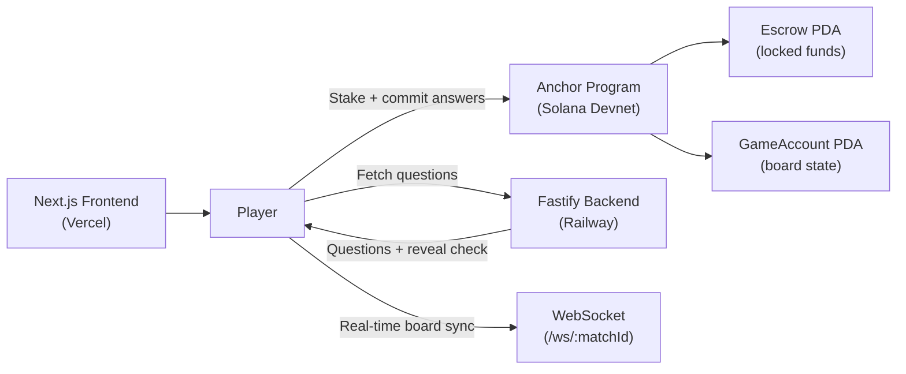
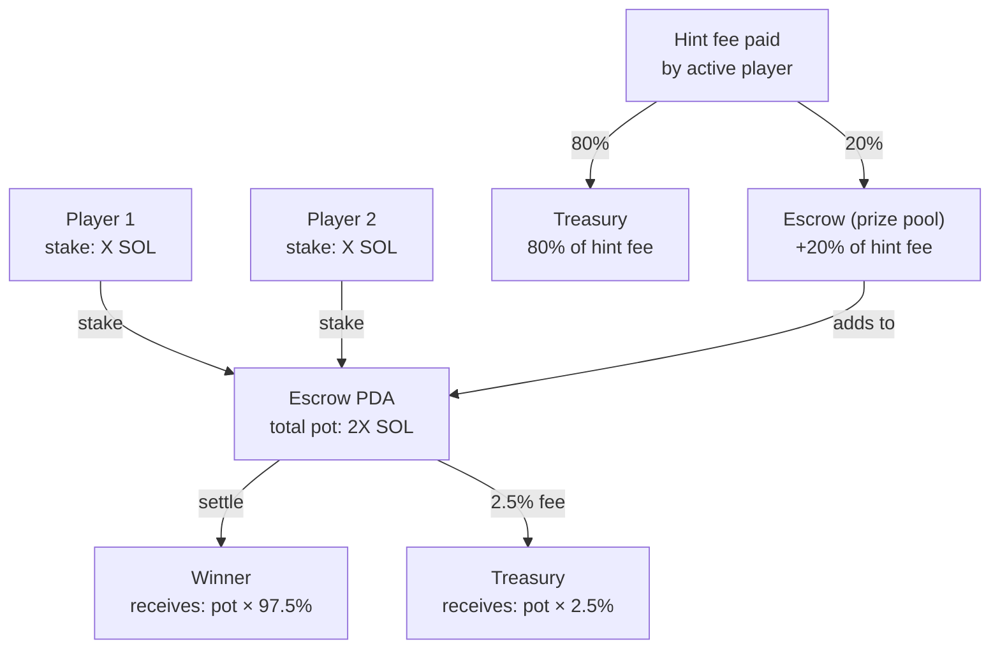

# MindDuel — Hackathon Submission

**Hackathon:** Colosseum Frontier 2026
**Track:** 100xDevs
**Category:** Consumer / Gaming on Solana
**Submission Date:** May 2026

---

## Problem Statement

On-chain gaming on Solana today falls into two buckets: pure chance (lottery/gambling) or speculation (NFT flip games). Neither rewards skill or knowledge. Meanwhile, real-money trivia games exist in Web2 — but they're fully centralized: the operator controls every question result, all funds, and can rug at any time.

**The gap:** There is no on-chain, provably fair, skill-based game on Solana where:
1. A player's knowledge determines the outcome — not luck or gas optimization.
2. Funds are locked in a trustless smart contract escrow.
3. Neither the platform nor the opponent can cheat.

---

## Solution

MindDuel is **trivia-gated PvP Tic Tac Toe on Solana**. To place a piece, you must answer a trivia question correctly. Every stake, move, and settlement is enforced by an Anchor smart contract. The platform cannot steal funds, and the opponent cannot front-run your answer.

Key innovations:

1. **Commit-reveal anti-cheat** — Players commit `SHA-256(answer_index || nonce)` on-chain before revealing. No oracle, no trusted intermediary.
2. **Dynamic board modes** — Classic 3x3, Shifting Board (board rotates every 3 rounds via slot entropy), and Scale Up (3x3 → 4x4 → 5x5 as correct answers accumulate).
3. **Hint micro-economy** — 5 purchasable hints priced in SOL and USDC. 20% of hint fees boost the winner's pot; 80% go to treasury. Enforced on-chain.
4. **Dual-currency** — Both SOL and mock-USDC (SPL) fully supported with dedicated Anchor instruction variants.
5. **Sponsored transactions** — Backend optionally pays gas fees (Solana's sub-cent transactions make this practical), enabling a zero-friction first-time user experience.

---

## Why Solana

| Requirement | Solana | Ethereum L2 | Other L1 |
|---|---|---|---|
| Sub-second finality | Yes (400ms) | No (2–10s) | Varies |
| Transaction cost | ~$0.00025 | $0.01–$0.50 | Varies |
| Per-turn gas sponsorship practical | Yes | Only with complex paymaster | No |
| On-chain randomness (slot entropy) | Clean and available | Chainlink VRF needed | Varies |
| Anchor framework | Yes (mature) | No equivalent | No equivalent |
| Global developer community | Yes (100xDevs track) | Smaller | Smaller |

Solana's 400ms block time means a commit-reveal round trip takes about 1 second — fast enough for a real game. On any other chain, two on-chain transactions per turn would be unusably slow or expensive.

---

## Unique Value Proposition

1. **The only trivia game with trustless escrow on Solana.** There is no central authority controlling the game outcome or holding funds.

2. **Commit-reveal without oracles.** Most on-chain games that need answer verification rely on centralized oracles (Chainlink, custom server with trust assumption). MindDuel uses client-side SHA-256 hashing — the contract verifies the hash directly. The trivia server only provides questions; it never learns who submitted which answer, and it has no power over on-chain outcomes.

3. **Skill layers over a familiar game.** Tic Tac Toe is universally understood. Adding a trivia gate creates a second skill axis: board strategy AND knowledge. Players who know more crypto/science/history win games they would otherwise lose on board strategy alone.

4. **Drama score and Epic Game NFT.** The on-chain `drama_score` field increments every turn. Games with drama score >= 80 unlock an "Epic Game" NFT badge — a soulbound token commemorating the match. You cannot buy an Epic Game badge; you can only earn it by playing an intense game.

---

## Architecture Summary



Full architecture: see `docs/ARCHITECTURE.md`.

---

## Live Demo Guide (For Judges)

**Live URL:** `https://mindduel.app` *(replace with actual URL before submission)*
**Demo Wallet:** Two browser windows, each with a different Phantom wallet funded with devnet SOL.

### Setup

1. Install Phantom wallet browser extension.
2. Switch Phantom to **Devnet** (Settings → Developer Settings → Devnet).
3. Airdrop 0.5 SOL to each wallet from the Phantom devnet faucet or via `solana airdrop 2`.
4. Open `https://mindduel.app` in two browser tabs.

### Step-by-step Demo Flow

**Tab 1 (Player 1):**

1. Click **Connect Wallet** → select Phantom. Approve connection.
2. Click **New Game** on the lobby page.
3. Select mode: **Shifting Board** (demonstrates the unique mechanic).
4. Select stake: **0.05 SOL** (Casual tier).
5. Select currency: **SOL**.
6. Click **Create Match**. Approve the Solana transaction in Phantom.
7. Copy the 6-character **Join Code** (format: `MNDL-XXXXXX`).

**Tab 2 (Player 2):**

1. Connect a different Phantom wallet.
2. Click **Join Game**.
3. Enter the Join Code from Tab 1.
4. Click **Join Match**. Approve the Solana transaction.

**Both tabs — Play the game:**

1. Player 1's turn: click a cell on the board.
2. A trivia question appears. Select the correct answer (or any answer to see the wrong-answer flow).
3. The frontend computes `SHA-256(answerIndex || nonce)` and submits `commitAnswer` on-chain. Phantom popup appears — approve.
4. After the commit confirms, the frontend calls the trivia reveal endpoint and submits `revealAnswer` on-chain. Second Phantom popup — approve.
5. If correct: the cell is marked with an X. Board shifts (ShiftingBoard mode — observe pieces move!).
6. Turn passes to Player 2. Player 2 does the same in Tab 2.
7. Continue until a winner or draw.

**Settle the game:**

1. On the result screen, click **Settle Game**.
2. The winner receives `pot * 97.5%` (2.5% platform fee deducted).
3. Verify on Solana Explorer: the explorer link is shown on the result screen.

**Leaderboard:**

- Click **Leaderboard** in the navigation.
- Your match should appear after a few seconds (the frontend calls `POST /api/match/finish` after settlement).

**Hint demo (optional):**

During your turn, before clicking a cell, click **Hints** panel → select **Eliminate 2** (0.002 SOL).
- Phantom popup shows the hint charge.
- Two wrong answers are visually eliminated.
- The correct answer is easier to identify.

**USDC demo (optional):**

1. Click the faucet button (test-tube icon) to receive 100 mock USDC.
2. Create a new match with currency set to **USDC**.
3. Flow is identical but funds move as SPL token transfers.

---

## On-Chain Verification

All game state is publicly readable on Solana devnet:

```bash
# Fetch the GameAccount PDA for a player
solana account $(solana-keygen pubkey ~/.config/solana/id.json) --url devnet

# View a specific transaction
solana confirm -v <TX_SIGNATURE> --url devnet
```

Or visit Solana Explorer:
```
https://explorer.solana.com/address/8XZTXNux374128LFJSVhp5XSNyYMPNZpfw4vyjWmSJkN?cluster=devnet
```

---

## Economic Model



| Item | Value |
|---|---|
| Minimum stake | 0.01 SOL |
| Platform fee (settle) | 2.5% of pot |
| Hint: Eliminate 2 | 0.002 SOL / 0.40 USDC |
| Hint: Category Reveal | 0.001 SOL / 0.20 USDC |
| Hint: Extra Time | 0.003 SOL / 0.60 USDC |
| Hint: First Letter | 0.001 SOL / 0.20 USDC |
| Hint: Skip Question | 0.005 SOL / 1.00 USDC |
| Hint treasury split | 80% |
| Hint prize pool boost | 20% |
| Draw resolution | 50/50 after fee |

**Revenue comes from:**
1. 2.5% fee on every settled match.
2. 80% of every hint purchase.
3. Future: Epic Game NFT mint fee (0.01 SOL).

---

## Technical Achievements

### On-Chain

- 14 Anchor instructions across SOL and USDC variants.
- Dynamic board (3x3/4x4/5x5) stored as a flat `[CellState; 25]` array.
- Deterministic board shift using `Clock::get()?.slot % 4` — no off-chain oracle needed.
- Bitmask-based hint tracking per `(game, player)` pair — prevents double-spending any hint.
- All arithmetic uses checked operations (`checked_mul`, `checked_div`, `checked_sub`) with `MindDuelError::Overflow` instead of panic.
- Treasury address hardcoded as a compile-time constant — cannot be redirected by callers.
- `settle_game` closes the GameAccount on completion, refunding rent to `player_one` and freeing the PDA for reuse.

### Frontend

- Fully typed TypeScript throughout — zero `any` types in production code.
- Framer Motion for all meaningful state transitions (board cell placement, turn switch, result reveal).
- Gasless UX via backend sponsor flow with graceful fallback to user-paid transactions.
- Real-time board sync via WebSocket with late-join replay (last `board_updated` event cached per room).
- Mobile-first responsive design; all touch targets >= 44px.

### Backend

- Fastify with Zod validation on every route — no unvalidated inputs reach business logic.
- Stateless trivia API: game logic is entirely on-chain; backend only caches question sessions.
- WebSocket rooms with per-connection rate limiting (60 msgs/30s) and size limiting (4KB) to prevent abuse.
- Neon PostgreSQL for match history and leaderboard — backend is horizontally scalable.

---

## Future Roadmap

| Phase | Feature | Description |
|---|---|---|
| V1.1 | Blitz Mode | 5-minute turn timer, fully live |
| V1.1 | Epic Game NFT | Soulbound Metaplex NFT for drama_score >= 80 matches |
| V1.2 | Tournament Mode | 4/8-player single-elimination brackets |
| V1.2 | Category Selection | Players agree on question categories pre-match |
| V2.0 | Mainnet Deployment | Real SOL/USDC stakes, KYC-free |
| V2.0 | Ultimate TTT | 9x9 meta-grid (each cell is its own 3x3 board) |
| V2.1 | Mobile App | React Native with Expo + mobile wallet adapter |
| V2.2 | Token ($MDUEL) | Governance + staking rewards for frequent players |
| V3.0 | AI Difficulty Tiers | vs-AI mode with progressive difficulty ratings |

---

## Team

| Name | Role | Background |
|---|---|---|
| Ezra Nahamry | Founder / Full-Stack / Smart Contract | Solo hacker. TypeScript, Rust, Solana. 100xDevs community. |

**Why a solo entry?** MindDuel was designed to be buildable by one developer in under 3 months. The architecture is deliberately constrained: stateless backend, all game logic on-chain, minimal external dependencies.

**Contact:** ezranhmry@gmail.com

---

## Repository

```
https://github.com/<your-org>/mind-duel
```

**Program ID (Devnet):** `8XZTXNux374128LFJSVhp5XSNyYMPNZpfw4vyjWmSJkN`
**Live Demo:** `https://mindduel.app`
**Demo Video:** *(YouTube link — to be added)*
