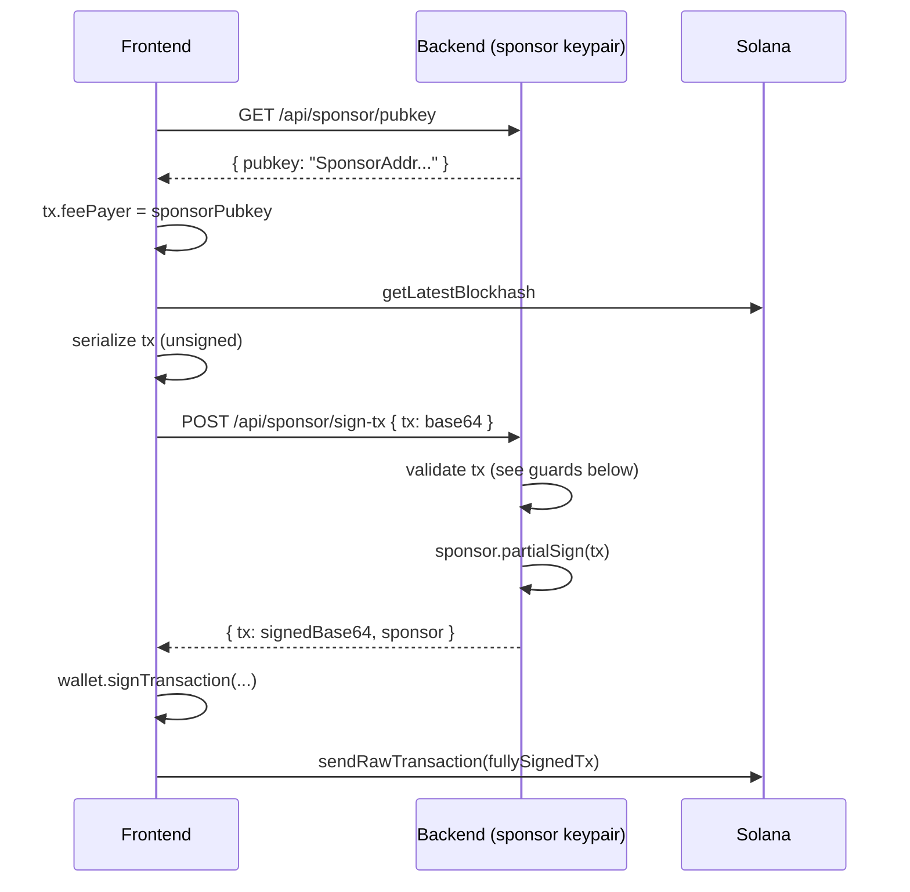

# Sponsored Gas (Gasless UX)

MindDuel can pay your transaction fees on devnet so first-time players never get blocked by "go fund a wallet first." The sponsor flow is opt-in, hardened against drains, and falls back to user-paid transactions if the sponsor is unreachable.

## How it works

The sponsor signs **only as fee payer**. The user's wallet still has to sign for any instruction where they are a required signer (e.g. transferring their stake into escrow). The backend never holds player funds; it only holds devnet SOL for fees.

## Security guards

The sponsor route is the most attack-juicy endpoint in the app — without guards, anyone could drain it. `backend/src/routes/sponsor.ts` enforces five independent checks before signing:

### 1. Allowlist of programs

Only instructions targeting these programs are accepted:

| Program | Why it is allowed |
|---|---|
| `8XZTXNux374128LFJSVhp5XSNyYMPNZpfw4vyjWmSJkN` | The MindDuel program itself |
| ComputeBudgetProgram | Fee bumps and compute unit limits |
| TOKEN_PROGRAM_ID (SPL Token) | USDC variants and ATA operations |
| ASSOCIATED_TOKEN_PROGRAM_ID | ATA creation |
| `11111111111111111111111111111111` (SystemProgram) | Required for Anchor PDA `init` flows |

Anything else is rejected with `400`. Without this guard, an attacker could craft a SystemProgram::Transfer drain.

### 2. Fee payer must be the sponsor

If `tx.feePayer` is not the sponsor's pubkey, the request is rejected. This stops a client from claiming a "sponsored" tx and quietly billing someone else.

### 3. Sponsor cannot be an instruction signer

The most important guard. Every instruction's account list is scanned. If the sponsor's pubkey appears as a required signer in **any instruction**, the request is rejected.

This matters because Solana's `partialSign` signs the entire transaction, not per-instruction. A malicious payload could include a `SystemProgram::Transfer { from: sponsor, to: attacker }` and use the sponsor's signature to authorize the drain. Refusing to sign when sponsor is an instruction signer eliminates that attack class entirely.

### 4. Per-IP rate limit

`30 requests per 60 seconds per IP`. Genuine play needs maybe one tx every 2 seconds; the cap comfortably covers that while making drain attempts financially boring. Buckets are GC'd every 5 minutes.

### 5. Schema validation

The `tx` field is validated as a base64 string by Zod before any decoding. Decoded transactions that fail to parse are rejected.

## Fallback behavior

If the sponsor endpoint returns 503 (not configured) or is unreachable, the frontend transparently falls back to user-paid transactions. The user's wallet pays its own fees as normal. No banners, no friction.

This is by design: sponsored gas is a UX upgrade, not a dependency.

## Configuration

The sponsor keypair can be loaded three ways (in priority order):

| Source | Env var | Use case |
|---|---|---|
| JSON array string | `SPONSOR_KEYPAIR_JSON` | Railway deployment (no file needed) |
| Base64 secret key | `SPONSOR_KEYPAIR_BASE64` | Alt deployment env |
| File path | `SPONSOR_KEYPAIR_PATH` | Local dev (defaults to `.keys/payer.json`) |

If none resolve, `GET /api/sponsor/pubkey` returns 503 and the frontend skips sponsorship.

## What sponsorship does NOT do

- It does **not** stake on your behalf. You still need SOL or USDC to cover your stake.
- It does **not** cover hint purchases. Hint claim transactions are user-paid.
- It does **not** work on mainnet (devnet only — there is no mainnet deployment).

## Why this matters

A new player landing on a Web3 game and being told "fund a wallet, switch networks, request airdrop, wait, retry" is the single biggest drop-off point in consumer crypto. Sponsored gas turns the first 30 seconds into "click connect, click play" — which is the only experience a casual player will tolerate.

For the full route source, see `backend/src/routes/sponsor.ts`. For the API schema, see [Backend API](../technical/backend-api.md).
