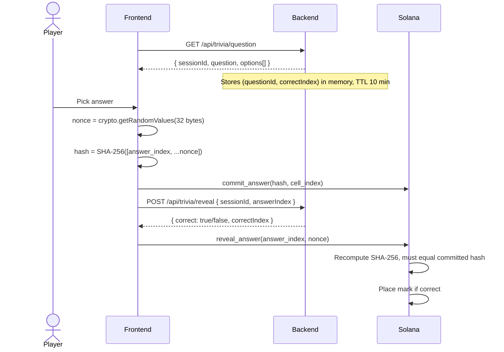

# Trivia Engine

The trivia engine is the gate that turns Tic Tac Toe into a real skill game. Every move requires a correct answer.

## The question bank

Questions are served by a stateless Fastify backend at `GET /api/trivia/question`. They come from a curated bank in `backend/src/data/questions.ts`.

### Categories

| Category | Coverage |
|---|---|
| **General Knowledge** | Broad trivia across topics |
| **Crypto & Web3** | Blockchain, DeFi, NFTs, Solana ecosystem |
| **Science** | Physics, biology, chemistry |
| **History** | World history, major events |
| **Math** | Arithmetic, algebra, logic puzzles |
| **Pop Culture** | Movies, music, internet culture |

Players can filter by one or more categories via query params: `?categories=Crypto+%26+Web3,Science`. If fewer than 3 questions match the filter, the server falls back to the full bank so the game never deadlocks.

### Difficulty tiers

| Tier | Client-side time limit |
|---|---|
| Easy | 30 seconds |
| Medium | 20 seconds |
| Hard | 15 seconds |

The timer is a UX cue, not a chain rule. Even after the visual timer hits zero, you can still submit; the on-chain timeout (24h Classic, 300s Blitz) is what actually enforces lateness.

## Commit-reveal flow

The whole point of the trivia engine is that **the backend never learns which answer you picked**, and the chain verifies the answer without trusting the backend.

The backend's `reveal` response is purely informational — the frontend uses it to decide whether to reveal with the real answer or with `255` (explicit "wrong"). The chain does not consult the backend; it only checks that whatever you reveal hashes to what you committed.

### Wrong-answer convention

If the backend says `correct: false`, the frontend calls `reveal_answer` with `answer_index = 255`. The program treats `255` as "explicitly wrong":

- Hash still has to verify (so you cannot fake a wrong-answer reveal without having committed).
- No piece is placed.
- Turn switches to opponent.

This keeps the turn flow clean even after a miss.

## Session lifecycle

| Step | TTL / Limit |
|---|---|
| Session created on `GET /api/trivia/question` | 10 minutes |
| Session invalidated on first `POST /api/trivia/reveal` | One-shot |
| Hint peeks (`/api/trivia/peek`) | One use per peek type per session |

Sessions are kept in-memory. If the backend restarts mid-match, players start a new session on the next turn — no on-chain effect.

## API surface

| Endpoint | Purpose |
|---|---|
| `GET /api/trivia/question` | Fetch a random question (no correct index) and create a session |
| `POST /api/trivia/reveal` | Reveal whether the player's answer was correct |
| `GET /api/trivia/peek` | Hint-driven partial reveal (`eliminate2`, `first-letter`) |
| `GET /api/trivia/categories` | List categories with question counts |
| `GET /api/trivia/stats` | Question bank statistics by category and difficulty |

See [Backend API](../technical/backend-api.md) for full request/response schemas.

## Why this matters

A naive design would have the chain ask a server "is answer 2 correct?" That bakes in trust in the server. MindDuel inverts the relationship: the chain verifies a hash that the player constructed locally. The server only ever serves questions and confirms results to the player's UI — never to the chain.

That is the difference between "trustless game" and "game that uses a blockchain."
