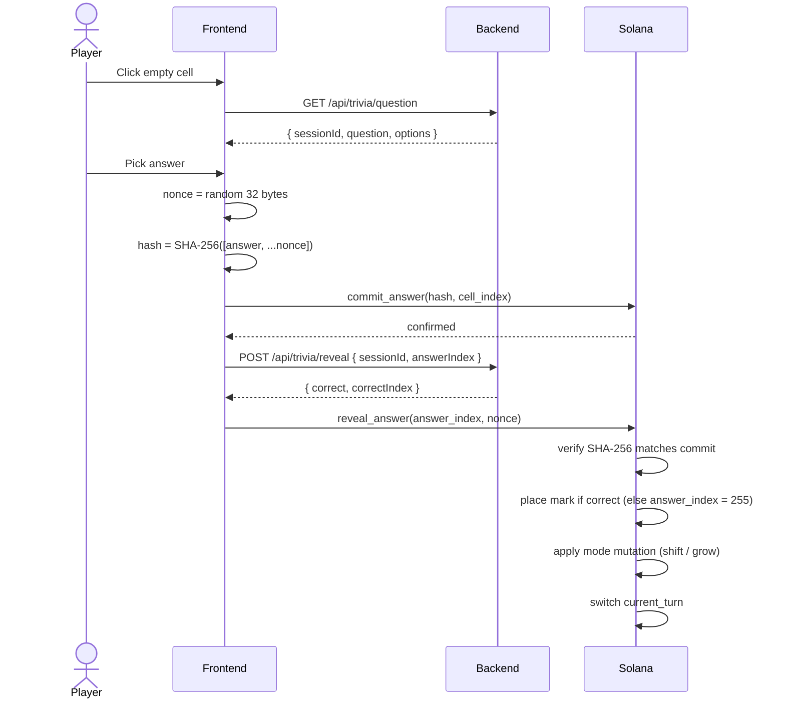

# How It Works

A complete MindDuel match has three phases: **stake**, **play**, **settle**. Here is what happens at each step, end to end.

## 1. Stake

### Player one creates a match

Player one calls `initialize_game` (or `initialize_game_usdc`) with their stake amount and chosen mode (`Classic`, `ShiftingBoard`, `ScaleUp`, `Blitz`). This:

- Creates a `GameAccount` PDA seeded by `["game", player_one]`.
- Transfers the stake into the escrow PDA seeded by `["escrow", game]`.
- Sets `game.status = WaitingForPlayer`.

The frontend exposes this as **Create Match** -> generates a `MNDL-XXXXXX` join code.

### Player two joins

Player two calls `join_game` (or `join_game_usdc`). The program:

- Verifies `player_two != player_one`.
- Transfers a matching stake into escrow.
- Sets `game.status = Active` and `pot = stake_per_player x 2`.

`current_turn` starts as `player_one`.

## 2. Play (one turn at a time)

Key things the program does inside `reveal_answer`:

1. Recompute `SHA-256([answer_index, ...nonce])` and require it equals `committed_hash`.
2. Zero out `committed_hash` immediately (kills replay attacks).
3. If `answer_index != 255` and not Blitz-timed-out: place `X` or `O` at `committed_cell`.
4. Apply mode mutation:
   - **ShiftingBoard:** every 3rd round, rotate the board. Direction = `Clock::get()?.slot % 4`.
   - **ScaleUp:** grow to 4x4 at round >= 4, then 5x5 at round >= 9.
5. Switch `current_turn`, increment `round`, increment `drama_score` (+5, capped at 100).

If the answer was wrong, the frontend submits `answer_index = 255` — an explicit "I missed." The hash still has to verify, but no piece is placed.

## 3. Settle

A game can end in three ways:

| Trigger | Detected by |
|---|---|
| Three in a row | `determine_winner` scans the active board area. |
| Board full with no winner | All `board_size^2` cells filled — draw. |
| Turn timed out | `now - last_action_ts >= timeout` (24h Classic, 300s Blitz). |

Anyone can call `settle_game` once one of those is true. The program:

1. Calculates `fee = pot x 2.5%`.
2. Sends `fee` to the hardcoded treasury.
3. Sends `pot - fee` to the winner (or splits 50/50 on draw).
4. Sets `game.status = Finished`.
5. Closes the `GameAccount`, refunding rent to `player_one`.

If neither player is willing to settle, the alternatives are:

- `timeout_turn` — any signer can force a turn switch after the inactivity window.
- `resign_game` — either player concedes, opponent gets `pot - fee`.
- `cancel_match` — only valid in `WaitingForPlayer` status, full refund.

## What is happening off-chain

The backend handles only the things that do not need trust:

- Serves trivia questions (the chain never sees the question text).
- Generates `sessionId` and stores `(questionId, correctIndex)` in memory for 10 minutes.
- Mirrors finished match results into Postgres for the leaderboard and history pages.
- Relays WebSocket messages between clients in the same room.
- Optionally sponsors transaction fees (see [Sponsored Gas](../features/sponsored-gas.md)).

If the backend disappears mid-match, you can still call `reveal_answer`, `settle_game`, `resign_game`, or `timeout_turn` directly — your funds are not stuck.

For a deeper dive into the contract, see [Smart Contracts](../technical/smart-contracts.md). For the full system map, see [Architecture](../technical/architecture.md).
