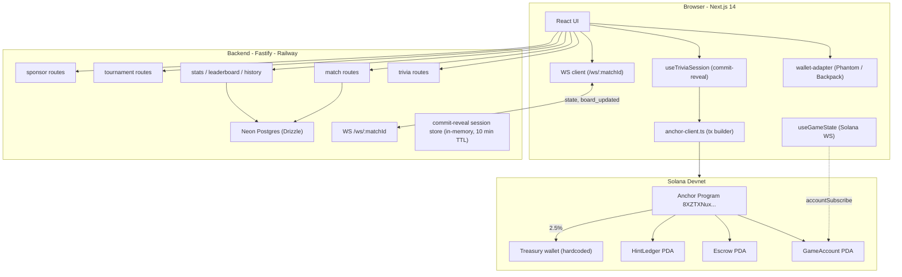
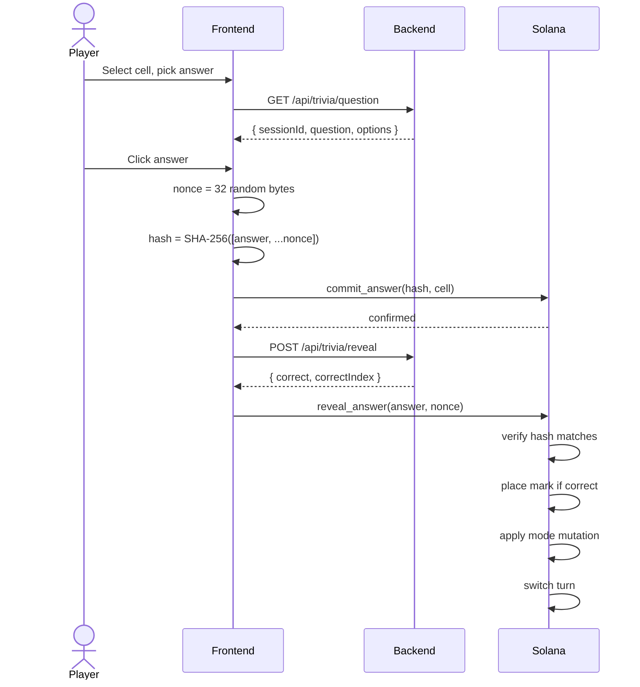
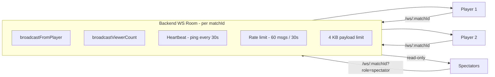

# Architecture

MindDuel is a three-layer system with sharply separated responsibilities. The boundaries are enforced by design — the backend is never in the critical path for financial correctness.

| Layer | Responsibility |
|---|---|
| **Solana / Anchor** | Trustless source of truth. Holds funds. Enforces rules. |
| **Fastify Backend** | Stateless question server. Match metadata mirror. WebSocket relay. Optional sponsor wallet. |
| **Next.js Frontend** | Transaction construction. Wallet integration. Real-time UI. |

If the backend disappears, in-progress games on-chain remain valid and settleable.

## System map



## One full turn — data flow



## Frontend (Next.js 14)

Key dependencies (from `frontend/package.json`):

| Package | Use |
|---|---|
| `next` 14 | App Router |
| `@coral-xyz/anchor` | Program client |
| `@solana/web3.js` | Transaction construction |
| `@solana/wallet-adapter-*` | Phantom / Backpack integration |
| `@solana/spl-token` | USDC ATA flows |
| `framer-motion` | Animations (board shift, transitions) |
| `tailwindcss` | Styling |

### Key hooks

| Hook | Purpose |
|---|---|
| `useGameState` | Subscribe to GameAccount PDA via Solana RPC WebSocket |
| `useAnchorClient` | Build AnchorClient bound to the connected wallet |
| `useTriviaSession` | Client-side commit-reveal: nonce + SHA-256 |
| `useHint` | Claim hint on-chain and fetch hint payload from backend |
| `useNetworkCheck` | Warn the user if their wallet is not on devnet |

### Pages

```
/                      Landing
/lobby                 Create / join / queue
/game/[matchId]        Live game room
/result                Settlement screen
/leaderboard           Global rankings
/history               Player match history
/tournaments           List of brackets
/tournaments/[id]      Bracket view
/spectate/[matchId]    Read-only spectator mode
/profile               Wallet profile + badges
```

## Backend (Fastify)

Single Node 20 process. Stateless except for the in-memory commit-reveal session store and the WebSocket room map.

```
backend/src/
  index.ts                      Bootstrap, CORS, plugins
  routes/
    trivia.ts                   Trivia question + reveal + peek
    match.ts                    Create / join / queue / state
    stats.ts                    Leaderboard / history / badges / finish
    tournament.ts               Bracket lifecycle
    faucet.ts                   Mock-USDC dispenser (devnet)
    sponsor.ts                  Gasless tx signing
    ws.ts                       /ws/:matchId rooms
  lib/
    db.ts, schema.ts            Drizzle ORM + Neon Postgres
    match-store.ts              Match CRUD + matchmaking queue
    commit-reveal.ts            In-memory session store (10 min TTL)
    badges.ts                   Badge metadata + award logic
    tournament-store.ts         Tournament + bracket state
  data/
    questions.ts                Curated trivia bank (6 categories, 3 difficulties)
```

## Anchor program

```
programs/mind-duel/src/
  lib.rs                        15 instruction handlers
  constants.rs                  Fees, timeouts, PDA seeds, treasury pubkey
  errors.rs                     MindDuelError (15 variants)
  state/
    game.rs                     GameAccount, GameStatus, GameMode, CellState, Currency
    hint_ledger.rs              HintLedger, HintType (bitmask)
  instructions/
    initialize_game.rs          + USDC variant
    join_game.rs                + USDC variant
    commit_answer.rs
    reveal_answer.rs
    claim_hint.rs               + USDC variant
    settle_game.rs              + USDC variant
    cancel_match.rs             + USDC variant
    resign_game.rs              + USDC variant
    timeout_turn.rs
```

## PDA derivation

| Account | Seeds | Notes |
|---|---|---|
| `GameAccount` | `["game", player_one]` | One active game per wallet |
| `Escrow` (SOL) | `["escrow", game]` | Program is the only signing authority |
| `Escrow` (USDC) | ATA of escrow PDA | `getAssociatedTokenAddressSync(usdcMint, escrowPda, true)` |
| `HintLedger` | `["hint", game, player]` | `init_if_needed` on first hint purchase |

## Real-time WebSocket layout



Last `board_updated` is cached per room and replayed to late-joining clients. Spectator outbound messages are silently dropped.

For the WebSocket protocol, see [Real-time Sync](./realtime-sync.md). For account schemas and instruction details, see [Smart Contracts](./smart-contracts.md).
